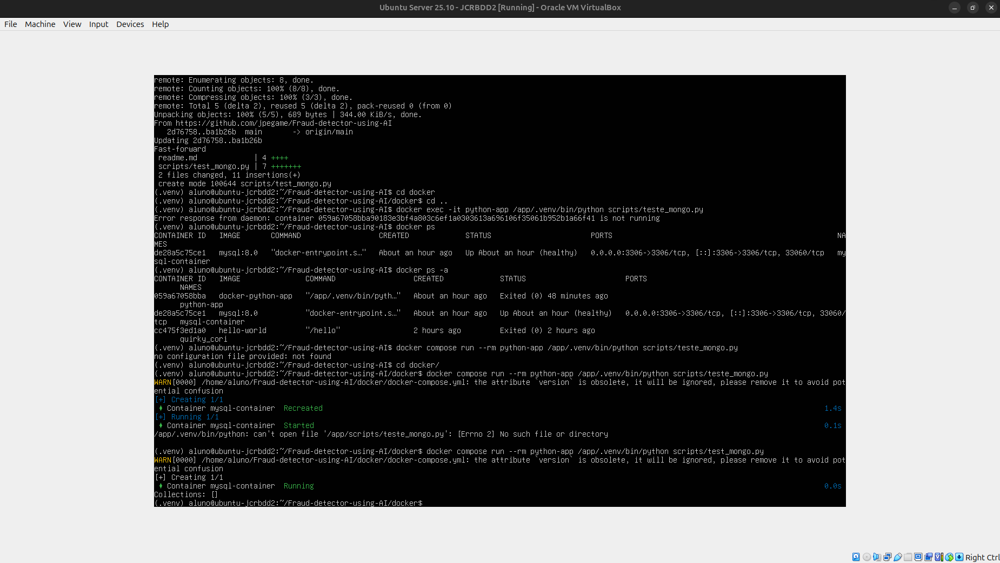
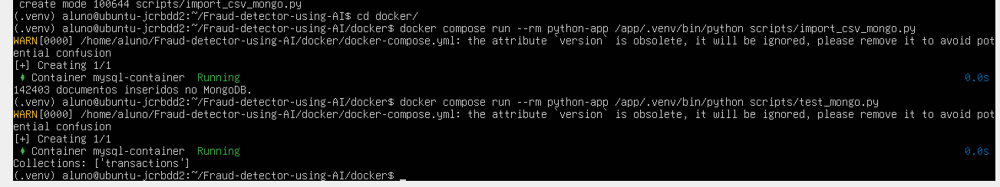

# Detector de Fraudes em Cartão de Crédito

Plataforma de Engenharia de Dados para detecção de fraudes utilizando arquitetura Medallion e Machine Learning.

---

## 📋 Arquitetura do Projeto

```
┌─────────────┐    ┌─────────────┐
│   MySQL     │    │  MongoDB    │
│ (Docker)    │    │  (Atlas)    │
└──────┬──────┘    └──────┬──────┘
       │                  │
       └────────┬─────────┘
                ▼
        ┌───────────────┐
        │ CAMADA BRONZE │  → Arquivos .txt
        └───────┬───────┘
                ▼
        ┌───────────────┐
        │ CAMADA SILVER │  → DataFrame (pickle)
        └───────┬───────┘
                ▼
        ┌───────────────┐
        │ CAMADA GOLD   │  → SQLite
        └───────┬───────┘
                ▼
        ┌───────────────┐
        │ MACHINE LEARN │  → Modelo RandomForest
        └───────────────┘
```

---

## 🚀 Como executar o projeto

### 1. Acesse a pasta docker e configure o ambiente

```sh
cd docker
cp example.env .env
```

Edite o `.env` com suas credenciais (MySQL e MongoDB Atlas).

### 2. Inicie os containers

```sh
docker compose up --build
```

### 3. Execute o pipeline completo

```sh
python scripts/run_pipeline.py
```

### 4. (Opcional) Execute via Apache Airflow

Copie a DAG para o Airflow:
```sh
cp dags/fraud_detection_dag.py ~/airflow/dags/
```

Acesse o Airflow em `http://localhost:8080` e ative a DAG `fraud_detection_pipeline`.

---

## 📁 Estrutura de Pastas

```
├── dags/                      # DAGs do Apache Airflow
│   └── fraud_detection_dag.py
├── data/
│   ├── bronze/                # Dados brutos em .txt
│   ├── silver/                # DataFrames processados (.pkl)
│   └── gold/                  # Banco SQLite
├── docker/
│   ├── docker-compose.yml
│   ├── Dockerfile
│   └── example.env
├── models/                    # Modelos de ML treinados
├── scripts/
│   ├── bronze_processing.py  # Extração para camada Bronze
│   ├── silver_processing.py  # Transformação para camada Silver
│   ├── gold_processing.py    # Carga para camada Gold
│   ├── train_model.py        # Treinamento do modelo ML
│   ├── run_pipeline.py       # Executa pipeline completo
│   ├── import_csv.py         # Importa CSV para MySQL
│   └── import_csv_mongo.py   # Importa JSON para MongoDB
└── requirements.txt
```

---

## 🔧 Tecnologias Utilizadas

| Componente | Tecnologia |
|------------|------------|
| VM | Ubuntu Server 25 |
| Container | Docker |
| BD Relacional | MySQL 8.0 |
| BD NoSQL | MongoDB Atlas |
| ETL | Python + Pandas |
| Orquestração | Apache Airflow |
| Data Lake | Arquitetura Medallion |
| Machine Learning | scikit-learn (RandomForest) |
| Camada Gold | SQLite |

---

## 🏗️ Arquitetura Medallion

### Camada Bronze
- Dados brutos extraídos do MySQL e MongoDB
- Formato: arquivos `.txt` (tab-separated)
- Local: `data/bronze/`

### Camada Silver  
- Dados limpos e consolidados
- Remoção de duplicatas e valores nulos
- Formato: pandas DataFrame (pickle)
- Local: `data/silver/`

### Camada Gold
- Dados prontos para análise
- Formato: tabelas SQLite
- Local: `data/gold/gold.db`

---

## 🤖 Machine Learning

- **Algoritmo**: Random Forest Classifier
- **Balanceamento**: SMOTE (Synthetic Minority Over-sampling)
- **Métricas**: Acurácia, Precision, Recall, F1-Score
- **Modelo salvo**: `models/fraud_model.pkl`

---

## 👥 Divisão do Grupo

| Membro | Responsabilidade |
|--------|------------------|
| [Nome 1] | Infraestrutura (Docker, VM, Bancos) |
| [Nome 2] | ETL e Pipeline de Dados |
| [Nome 3] | Machine Learning |
| [Nome 4] | Documentação e Apresentação |

---

## 📸 Screenshots

### VM Ubuntu rodando


O ambiente de desenvolvimento foi configurado utilizando a máquina virtual Ubuntu Server 25 disponibilizada pelo docente. A VM encontra-se funcional, com Docker, Python 3, ambiente virtual (.venv) e Apache Airflow corretamente instalados e testados.


## Rodando o MYSQL no container Docker dentro da VM


O banco de dados relacional foi inicializado automaticamente pelo container MySQL utilizando variáveis de ambiente, enquanto a criação das tabelas e a inserção dos dados foram realizadas via script Python durante a etapa de ingestão.

> OBS: 2 containers foram incializados, um para o mysql e o outro para rodar o script de ingestão python

## Inserindo dados na tabela do mysql 


A ingestão dos dados foi realizada por meio de um script Python executado em container Docker, responsável por ler os arquivos CSV e persistir os dados no banco MySQL.

## Criação do cluster no mongodb

O MongoDB foi utilizado por meio do serviço gerenciado MongoDB Atlas, permitindo o acesso a um banco NoSQL hospedado em nuvem para armazenamento dos dados semi-estruturados.



> OBS: A última linha `connections: []` envidencia que a conexão com o MongoDB ocorreu com sucesso.

## Inserção do JSON no mongo



Nessa etapa, utilizamos uma build temporária do container para scripts python para rodar o script `import_csv_mongo.py`, foi responsável por obter os dados da segunda partição do .csv, traduzir para JSON e inserir no Banco de Dados MongoDB. A última linha prova essa inserção.

## Camadas do medalhão

### Camada bronze

Já pode ser considerado o .csv bruto, visto que tem a mesma estrutura de um .txt

### Camada silver

Na camada Silver, os dados foram carregados a partir do MySQL e processados utilizando pandas DataFrames, incluindo limpeza, seleção de atributos relevantes e agregações.

### Camada Gold

Os dados consolidados da camada Silver foram persistidos na camada Gold em um banco de dados relacional SQLite, possibilitando consultas analíticas e suporte à modelagem.