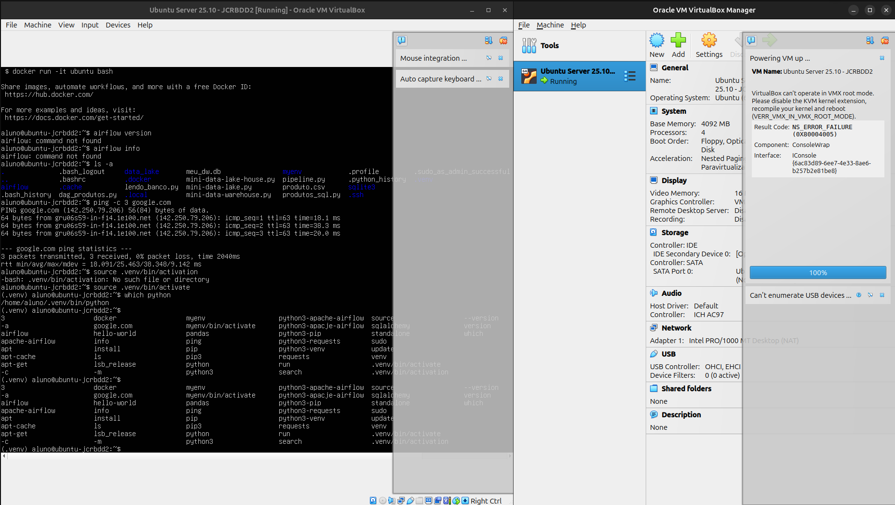
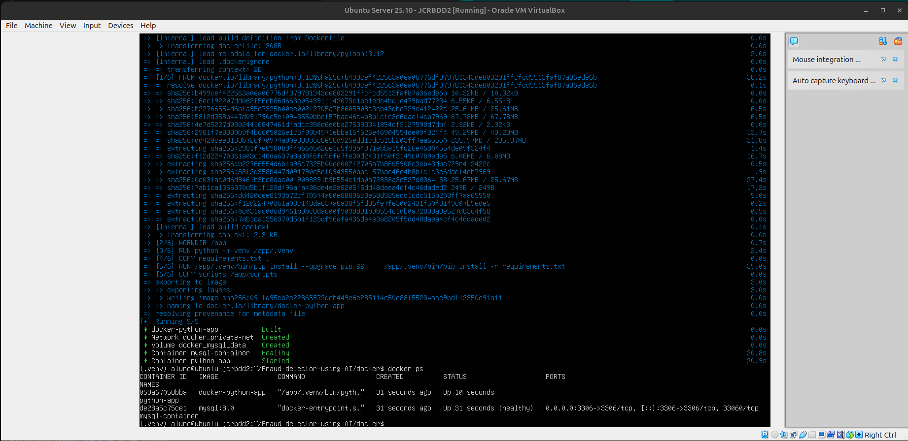
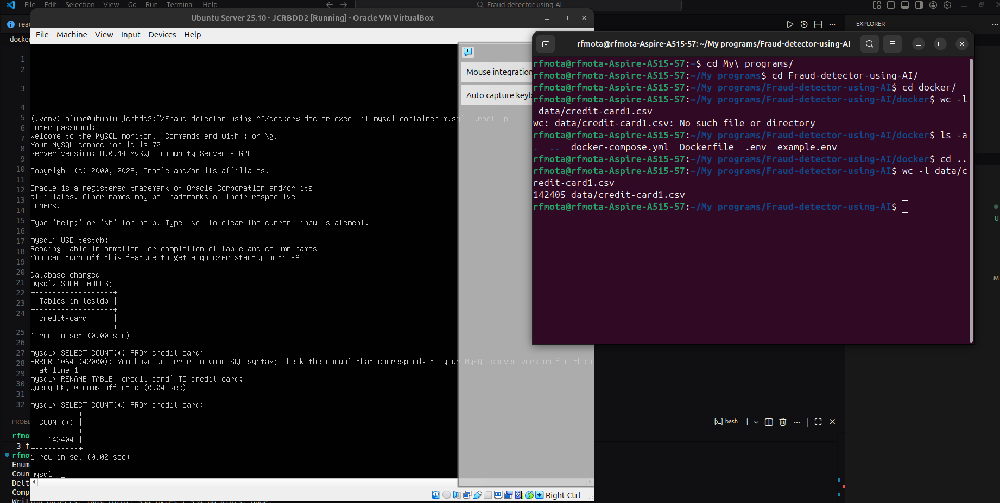

# Detector de fraudes de cartão de crédito

Este projeto utiliza **Docker** para facilitar a execução do ambiente completo sem dependências manuais.

---

## 🚀 Como iniciar o projeto

Siga os passos abaixo para preparar e executar o ambiente:

### 1. Acesse a pasta `docker`

```sh
cd docker
```

---

### 2. Crie o arquivo `.env`

Dentro da pasta `docker`, existe um arquivo chamado `example.env`.  
Utilize-o como base para criar seu arquivo `.env`:

```sh
cp example.env .env
```

Edite o `.env` conforme necessário (usuários, senhas, portas, etc.)

> [!NOTE]
> Para inserir mais váriaveis de ambiente, adicionar no docker-compose.yml
> <br>
> OBS: Apenas o .env da pasta docker surte alterações no código

---

### 3. Inicie os containers

Execute o comando abaixo para construir e iniciar os serviços:

```sh
docker compose up --build
```

Após a primeira execução, você pode usar apenas:

```sh
docker compose up
```

> [!NOTE]
> Para inserir mais serviços, execute semelhante ao servio do python-app ou altere no DockerFile para adicionar novo comando

---

## 🛠️ Verificando o Banco de Dados

Para confirmar se o MySQL foi criado e está rodando corretamente, execute:

```sh
docker exec -it mysql-container mysql -u root -p
```

Digite a senha configurada no arquivo `.env`.

---

## ✔️ Pronto!

Seu ambiente está configurado e funcionando via Docker.  
Caso precise parar os containers, execute:

```sh
docker compose down
```

---

## Criação da VM Ubuntu, e a mesma rodando para o ambiente de desenvolvimento



O ambiente de desenvolvimento foi configurado utilizando a máquina virtual Ubuntu Server 25 disponibilizada pelo docente. A VM encontra-se funcional, com Docker, Python 3, ambiente virtual (.venv) e Apache Airflow corretamente instalados e testados.


## Rodando o MYSQL no container Docker dentro da VM



O banco de dados relacional foi inicializado automaticamente pelo container MySQL utilizando variáveis de ambiente, enquanto a criação das tabelas e a inserção dos dados foram realizadas via script Python durante a etapa de ingestão.

> OBS: 2 containers foram incializados, um para o mysql e o outro para rodar o script de ingestão python

## Inserindo dados na tabela do mysql 



A ingestão dos dados foi realizada por meio de um script Python executado em container Docker, responsável por ler os arquivos CSV e persistir os dados no banco MySQL.

